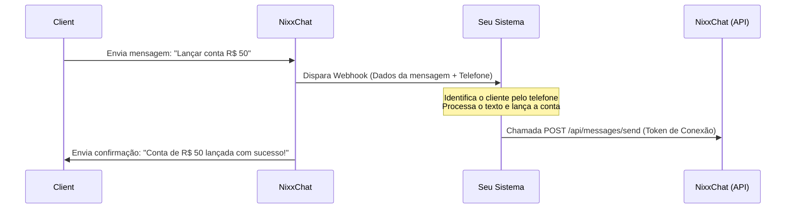

# Guia de Integração: NixxChat & Sistema Financeiro via Webhook

Este documento descreve a arquitetura e o passo a passo para integrar o **NixxChat** ao seu sistema de gestão, permitindo que clientes lancem cobranças e contas de forma totalmente automatizada enviando comandos via WhatsApp.

---

## 1. Fluxo da Operação

O fluxo funciona como um sistema de autoatendimento transacional por comandos de texto (regex ou IA).



---

## 2. Configurando o Recebimento no NixxChat (Entrada)

Para que o NixxChat envie as mensagens recebidas para o seu sistema:

1. Acesse o painel do **NixxChat**.
2. Vá ao menu **Integrações** (Administração) e clique em **Adicionar Projeto**.
3. Configure os seguintes campos:
   * **Tipo**: Selecione `WebHooks` ou `N8N`.
   * **Nome**: Escolha um nome identificador (Ex: `Sistema Financeiro Nixx`).
   * **URL**: A rota pública do seu sistema preparada para receber dados (Ex: `https://meusistema.com/api/webhooks/whatsapp`).
4. Clique em **Adicionar**.
5. Vá ao menu **Filas & Chatbot**, edite/crie a Fila de entrada correspondente e vincule essa nova Integração a ela.
6. Vá em **Conexões**, edite a conexão do seu WhatsApp e adicione essa Fila a ela.

---

## 3. O que o seu Sistema Receberá (Webhook Payload)

Toda vez que uma nova mensagem for recebida, o NixxChat enviará uma requisição HTTP do tipo **POST** para a URL configurada com o seguinte formato de payload:

```json
{
  "event": "message.created",
  "whatsappId": 1,
  "companyId": 1,
  "contact": {
    "id": 12,
    "name": "Eduardo Almeida",
    "number": "5511999999999"
  },
  "message": {
    "id": "MSG_1234567890",
    "body": "Lancar conta R$ 50",
    "fromMe": false,
    "type": "chat"
  }
}
```

---

## 4. O Processamento no seu Sistema (Lógica de Negócio)

Ao receber a requisição em `https://meusistema.com/api/webhooks/whatsapp`:

1. **Identificar o Cliente**: Busque no banco de dados do seu sistema se existe algum cliente cadastrado com o número de telefone contido em `contact.number`.
2. **Interpretar o Comando**: Analise o texto contido em `message.body`. Você pode usar Expressões Regulares (Regex) ou conectar à API do ChatGPT (OpenAI) para extrair a intenção e o valor (Ex: identificar que a intenção é criar um lançamento e o valor é `50.00`).
3. **Executar a Ação**: Faça o lançamento da cobrança no módulo financeiro do seu sistema para a conta do cliente identificado.

---

## 5. Respondendo ao Cliente via API do NixxChat (Saída)

Após processar o lançamento financeiro, o seu sistema pode enviar uma mensagem de confirmação de volta ao cliente. Para isso, você usará a API nativa do NixxChat.

### Obter o Token de Conexão
No painel do NixxChat, acesse **Conexões**, edite o canal de WhatsApp que está utilizando e copie o valor contido no campo **Token** (se estiver vazio, clique em gerar).

### Chamada de Envio de Mensagem:
* **Método**: `POST`
* **URL**: `https://api-nixxchat.nixxsuite.com.br/api/messages/send`
* **Headers**:
  * `Authorization`: `Bearer SEU_TOKEN_AQUI`
  * `Content-Type`: `application/json`
* **Corpo (JSON)**:
```json
{
  "number": "5511999999999", 
  "body": "Olá! O lançamento de R$ 50,00 foi registrado com sucesso na sua conta Nixx Suite. Segue o link para pagamento: https://meusistema.com/fatura/123",
  "closeTicket": true
}
```

*(O parâmetro `"closeTicket": true` serve para fechar o chat aberto no painel do NixxChat automaticamente, evitando poluir a tela dos operadores humanos).*
